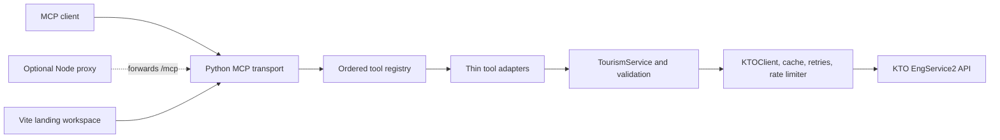

# VisitKorea MCP Server

[](https://www.python.org/)
[](https://pypi.org/project/mcp/)
[](LICENSE)

## Overview

VisitKorea MCP Server is an installable Python 3.11+ Model Context Protocol
(MCP) server for the Korea Tourism Organization (KTO) English Tourism
Information Service API, `EngService2`. It gives MCP clients structured access
to English tourism data from [data.go.kr](https://www.data.go.kr/data/15101753/openapi.do).

The primary application exposes exactly 14 tools in stable order. It supports
MCP stdio for local clients and stateless Streamable HTTP for remote clients.
The repository also contains an optional Node.js proxy and a separate Vite
landing workspace.

## Key Features

- Area, location, keyword, festival, and accommodation searches
- Common, introductory, detailed, and image information for tourism content
- Delta synchronization for changed or added content
- New legal district and classification code lookups
- Legacy area and category code lookups
- Input validation, safe error responses, retries, caching, and upstream rate limiting
- Isolated client, cache, and rate limiter state for each constructed server

## Tech Stack

| Layer | Technology |
| --- | --- |
| MCP server | Python, MCP SDK 1.27.0 |
| HTTP transport | Starlette, Uvicorn, stateless Streamable HTTP |
| Upstream client | HTTPX |
| External service | KTO EngService2 at `apis.data.go.kr` |
| Optional proxy | Node.js, Express, Helmet, CORS, `express-rate-limit` |
| Optional landing workspace | React and Vite |
| Package managers | pip for Python, pnpm for the optional Node workspace |
| License | MIT |

## Architecture

The deployed default is the Python server with the built Vite landing page
served at `/`. Local HTTP mode binds to `127.0.0.1:3001` by default. The Replit
deployment overrides the host to `0.0.0.0` and exposes `/`, `/api`, `/mcp`, and
`/healthz`.



The optional Node proxy can add Helmet headers, open CORS, a 120 requests per
minute per IP limit on `/mcp`, query-stripped request logging, and a 35 second
proxy timeout. The current Replit deployment runs Python directly, so those
proxy protections do not apply there.

## Tools

All tools return structured JSON text through MCP. Parameter schemas are
maintained in
[`visitkorea-mcp/src/mcp_server/tools/schemas`](visitkorea-mcp/src/mcp_server/tools/schemas)
and endpoint mappings are described in
[`visitkorea-mcp/docs/capabilities.md`](visitkorea-mcp/docs/capabilities.md).

| # | Tool | KTO endpoint | Purpose |
| ---: | --- | --- | --- |
| 1 | `search_tourism_by_area` | `areaBasedList2` | Search by province, city, district, content type, or category |
| 2 | `search_tourism_by_location` | `locationBasedList2` | Search within a GPS radius, sorted by distance |
| 3 | `search_tourism_by_keyword` | `searchKeyword2` | Search tourism content by English keyword |
| 4 | `search_festivals_and_events` | `searchFestival2` | Search festivals and events by date range |
| 5 | `search_accommodations` | `searchStay2` | Search hotels, pensions, guesthouses, and camping sites |
| 6 | `get_tourism_common_info` | `detailCommon2` | Get overview, address, coordinates, contact, and description data |
| 7 | `get_tourism_intro_info` | `detailIntro2` | Get content type specific introductory fields |
| 8 | `get_tourism_detail_info` | `detailInfo2` | Get repeating details such as rooms, menus, or programmes |
| 9 | `get_tourism_images` | `detailImage2` | Get image URLs and image copyright types |
| 10 | `get_sync_list` | `areaBasedSyncList2` | Get content added or modified after a timestamp |
| 11 | `get_legal_district_codes` | `ldongCode2` | Look up the new legal district code system |
| 12 | `get_classification_codes` | `lclsSystmCode2` | Look up the new classification hierarchy |
| 13 | `get_area_codes` | `areaCode2` | Look up legacy province and district codes |
| 14 | `get_category_codes` | `categoryCode2` | Look up the legacy category hierarchy |

## Repository Structure

```text
.
├── visitkorea-mcp/
│   ├── src/mcp_server/       Python package implementation
│   ├── tests/                Unit, integration, contract, and security tests
│   ├── docs/                 Architecture, capability, deployment, and security docs
│   ├── main.py               Compatibility launcher
│   ├── pyproject.toml        Package metadata and console entry point
│   └── requirements.txt      Direct runtime compatibility pins
├── artifacts/
│   ├── api-server/           Optional Node proxy
│   └── landing/              Optional Vite landing workspace
├── .github/workflows/ci.yml  Python package checks
├── .replit                   Replit deployment configuration
├── pnpm-workspace.yaml       Optional Node workspace configuration
└── LICENSE
```

## Requirements

### Required Python application

- Python 3.11 or newer
- pip
- A KTO Open API service key from
  [data.go.kr](https://www.data.go.kr/data/15101753/openapi.do)

### Optional Node workspace

- Node.js 24 for the configured CI and workspace environment
- pnpm

The Node workspace is not required to run the Python MCP server.

## Environment Variables

| Variable | Required | Default | Purpose |
| --- | --- | --- | --- |
| `VISITKOREA_API_KEY` | Yes | None | KTO service key. The value is URL-decoded at startup. |
| `PRODUCTION_MCP_URL` | Recommended | None | Public production MCP endpoint displayed by the landing page. |
| `PORT` | No for Python | `3001` | Python HTTP port. The Node proxy requires this variable for its public port. |
| `VISITKOREA_TIMEOUT` | No | `30` | Python upstream request timeout in seconds. |
| `PYTHON_PORT` | No for Node proxy | `3001` | Port used by the Node proxy to reach its Python child process. |

Use [`visitkorea-mcp/.env.example`](visitkorea-mcp/.env.example) as a
configuration reference. The application does not load `.env` files
automatically, so export variables in the process environment or use a secret
manager. Do not commit the API key. For Replit, store
`VISITKOREA_API_KEY` in Secrets.

## Installation

Install the Python package in editable mode from the repository root:

```bash
python -m pip install -e visitkorea-mcp
```

The package installs the pinned MCP SDK, HTTPX, Uvicorn, and Starlette
dependencies declared in
[`visitkorea-mcp/pyproject.toml`](visitkorea-mcp/pyproject.toml).

## Local Development

Set the required key before starting a server:

```bash
export VISITKOREA_API_KEY="your_service_key_here"
```

### Stdio

Use stdio for local MCP clients:

```bash
python visitkorea-mcp/main.py
```

After editable installation, these equivalent commands are available:

```bash
python -m mcp_server
visitkorea-mcp
```

Stdout is reserved for MCP protocol messages. Application logs go to stderr.

### Streamable HTTP

Start the Python HTTP server directly:

```bash
python visitkorea-mcp/main.py --http --port 3001
```

After installation, the package entry point supports the same mode:

```bash
python -m mcp_server --http --port 3001
visitkorea-mcp --http --port 3001
```

The default host is `127.0.0.1`. The HTTP routes are:

| Route | Method | Purpose |
| --- | --- | --- |
| `/` | GET | Built VisitKorea landing page in Replit deployments; readiness JSON when no build is present |
| `/api` | GET, POST | Compatibility readiness endpoint for platform probes |
| `/api/config` | GET | Public MCP host configuration used by the landing page |
| `/mcp` | GET, POST, DELETE | Stateless Streamable HTTP MCP transport |
| `/healthz` | GET | Returns `200` when ready and `503` while starting |

## MCP Client Configuration

### Local stdio client

Use an absolute path to the compatibility launcher in an MCP client
configuration:

```json
{
  "mcpServers": {
    "visitkorea": {
      "command": "python3",
      "args": ["/absolute/path/to/visitkorea-mcp/main.py"],
      "env": {
        "VISITKOREA_API_KEY": "your_service_key_here"
      }
    }
  }
}
```

### Remote Streamable HTTP client

Use the deployment-specific URL. No public URL is assigned by this
repository:

```json
{
  "mcpServers": {
    "visitkorea": {
      "type": "streamableHttp",
      "url": "https://your-deployment.example/mcp"
    }
  }
}
```

OAuth and client authentication are not implemented by this server.

## Build and Packaging

Build a wheel from the Python package directory:

```bash
cd visitkorea-mcp
python -m pip wheel --no-deps --no-build-isolation -w dist .
```

The wheel is written to `visitkorea-mcp/dist`. The compatibility launcher
remains available from the source checkout for existing client configurations.

## Testing and Code Quality

Run the Python test suite:

```bash
cd visitkorea-mcp
python -m unittest discover -s tests -v
```

Run the other configured Python checks:

```bash
python -m compileall -q src
python -m pip wheel --no-deps --no-build-isolation -w /tmp/visitkorea-dist .
```

The repository does not define a separate Python lint command. CI runs the
Python installation, test, import, compile, and wheel build checks. The
optional Node workspace is excluded from CI until its missing workspace
packages are restored.

## Optional Node Proxy and Landing Workspace

The Node proxy in `artifacts/api-server` can spawn the Python HTTP server and
forward `/mcp`. Its entry point requires `PORT` and accepts optional
`PYTHON_PORT`, which defaults to `3001`:

```bash
export VISITKOREA_API_KEY="your_service_key_here"
export PORT="8080"
pnpm --filter @workspace/api-server run dev
```

The landing workspace is a separate Vite application:

```bash
pnpm --filter @workspace/landing run dev
```

The Replit production build compiles this workspace and the Python server
serves the resulting static files at `/`. The development command serves the
landing workspace separately.

## Deployment

### Replit autoscale

The configured `.replit` deployment installs and builds the landing workspace,
then installs Python dependencies into the deployment user environment:

```bash
pnpm --filter @workspace/landing install --frozen-lockfile
BASE_PATH=/ PORT=3000 pnpm --filter @workspace/landing run build
rm -rf .pythonlibs
python3.11 -m pip install --no-cache-dir \
  -r visitkorea-mcp/requirements.txt
```

It then starts the service on the deployment network interface:

```bash
python3.11 visitkorea-mcp/main.py \
  --http --host 0.0.0.0
```

Before deployment, add `VISITKOREA_API_KEY` to Secrets. The Python server
uses the platform supplied `PORT`; the public URL is assigned by the deployment
platform. The direct Python deployment does not add the Node proxy's headers,
rate limiting, or request logging.

### Self-hosted HTTP

Install the package, set the key, and start the server:

```bash
python -m pip install -e visitkorea-mcp
export VISITKOREA_API_KEY="your_service_key_here"
export PORT="3001"
python visitkorea-mcp/main.py --http
```

Place public HTTP deployments behind an access controlled and rate limited
gateway appropriate for the deployment.

## Security Notes

- Keep `VISITKOREA_API_KEY` in the environment or a secret manager. Never
  commit it.
- The server URL-decodes the key at startup and masks it from upstream errors.
- Uvicorn access logs are disabled to avoid recording incoming request details.
- Cache keys are hashed and do not contain the raw API key.
- Inputs are validated before upstream requests, including dates, coordinates,
  radius, and bounded result pages.
- Unknown tools and expected upstream failures produce safe error responses.
- The process-local cache stores nonempty search results for up to five minutes
  and reference data for up to one hour.
- The process-local upstream limiter allows 10 KTO requests per minute with a
  burst capacity of five.
- Python HTTP binds to loopback by default. Direct public deployments should
  use appropriate access controls.
- The optional Node proxy has open CORS by design, plus Helmet headers, a
  120 requests per minute per IP limit on `/mcp`, query-stripped logging, and
  a 35 second proxy timeout. These protections are not present in direct
  Python deployment.

See [`visitkorea-mcp/SECURITY.md`](visitkorea-mcp/SECURITY.md) and
[`visitkorea-mcp/docs/security.md`](visitkorea-mcp/docs/security.md) for the
maintained security guidance.

## Known Limitations

- KTO availability, upstream response quality, and the documented API quota
  can limit results.
- Cache and rate limiter state is process-local. There is no database,
  persistent cache, or shared state.
- OAuth and client authentication are not implemented.
- Direct Python deployment does not receive the optional Node proxy's
  security headers or rate limiting.
- The current GitHub tree lacks the `lib/db`, `lib/api-zod`, and
  `lib/api-client-react` workspace packages referenced by the optional Node
  proxy. Root `pnpm install` is configured to install only root dependencies,
  and the production build filters installation to the self-contained landing
  workspace. Recursive workspace installation, type checking, and the optional
  proxy build may fail until those packages are restored. The Python package,
  landing page, and their checks remain independently runnable.

## Troubleshooting

### `VISITKOREA_API_KEY is required`

Set the variable before starting the server:

```bash
export VISITKOREA_API_KEY="your_service_key_here"
```

### The HTTP port is unavailable

Choose another port with `PORT` or `--port`:

```bash
PORT=3002 python visitkorea-mcp/main.py --http
python visitkorea-mcp/main.py --http --port 3002
```

### `/healthz` returns `503`

The HTTP session manager is still starting or the process is shutting down.
Check the process output and confirm that the configured API key is present.

### Node workspace commands cannot resolve `@workspace/*`

The optional Node workspace currently references package directories that are
not present in the GitHub tree. Use the Python installation and test commands
above, or restore the missing workspace packages before using the Node
commands.

## Contributing

Read [`visitkorea-mcp/CONTRIBUTING.md`](visitkorea-mcp/CONTRIBUTING.md) before
submitting changes. At minimum, run the Python tests, compile check, and wheel
build. Do not add live API calls or credentials to tests.

## License and Data Terms

The source code is licensed under the MIT License. See
[`LICENSE`](LICENSE).

Tourism data is provided by KTO through the
[data.go.kr open API](https://www.data.go.kr/data/15101753/openapi.do).
Follow the KTO data usage terms. Attribution is required for `Type1` content.
`Type3` content additionally prohibits modification.